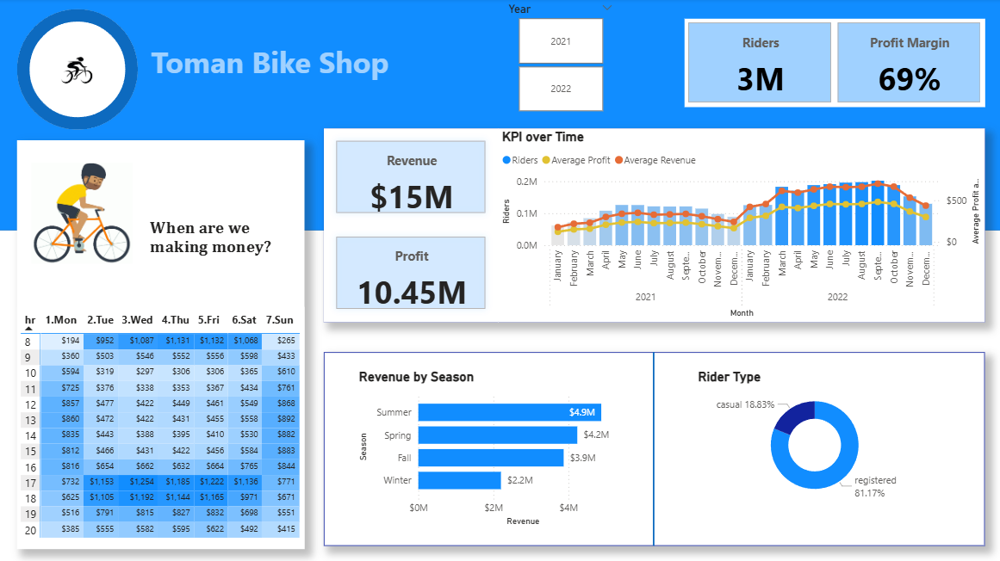

# Toman-Bike-Shop
Data Analysis | Beginner Project | SQL | Power BI

# Description
- Analyzing Bike Sales of years 2021 and 2022. Predicting the effects of raising prices next year. 
- KPIs: Revenue, Profit.
- Goals:

  1. Exploring gathered data
      Creating database
      Importing .csv files as tables
      Writing queries to produce final table

  2. Building a dashboard
     
      Importing data from SQL Server
      Transforming data in Power Query
      Creating measure for Profit Margin
      Representing Hourly Revenue, Profit and Revenue Analysis, Seasonal Revenue, Rider Types

# Dashboard

# Technologies Used:
SQL Server Management Studio, Power BI Desktop

# Answer:
Even though prices rose 25% in 2022 compared to 2021, we still experienced increases in customers, revenue, and profit.
Thus, the recommendation is to increase price by 10% in 2023, test customer response, and adjust accordingly.

  
